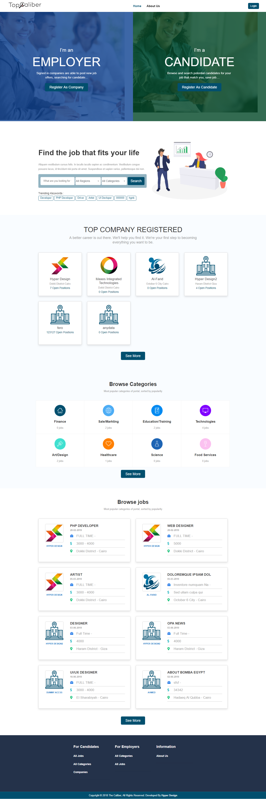

# Topcaliber 
-----------

 a website allows its users to search for jobs in a range of fields.Two types of users can register on the site
 1-Job Seeker(candidate) : He can search for a job that suits her abilities and skills.The site also allows him to create his own CV        that enables the applicant companies to access it. The site also allows him to see the path of jobs that applied to it and to know      the status reached by each application . 
 2 - Hr (Company) : 
 

when you write notes, to-do lists and  shopping lists,
Color Notes is a good helper to manage your schedules and notes

Live Website preview
-----------
* (https://www.topcaliber.org/) 

 Key features: 
-----------
* authentication by social login [Google and Facebook] and Capatcha for confiremation 
* Advanced search by name, regions and fields
* cv genrator for job seekers.
* make a wish list for saved jobs.
* tracking the path of submitted applications to know the status of each application.
* notifications system.
* 

Screenshot
-----------

  

About me
-----------
 You can follow me at:
1. [Linkedin](https://github.com/AhmeHalim)
2. [Linkedin](https://www.linkedin.com/in/ahmed-abd-el-halim/)
3. [Facebook](https://www.facebook.com/ahmed.elgheny.14)

  

